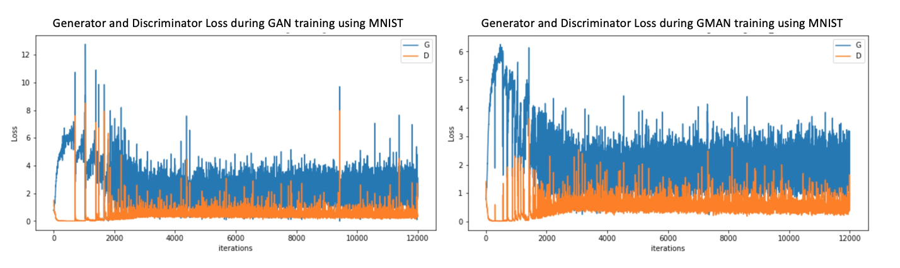
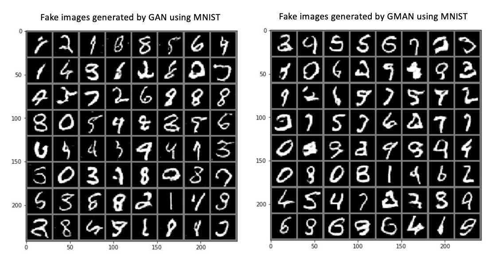
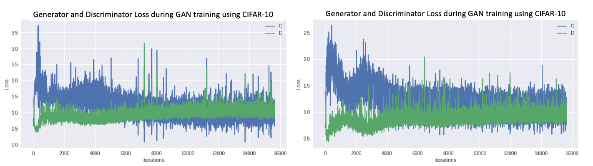
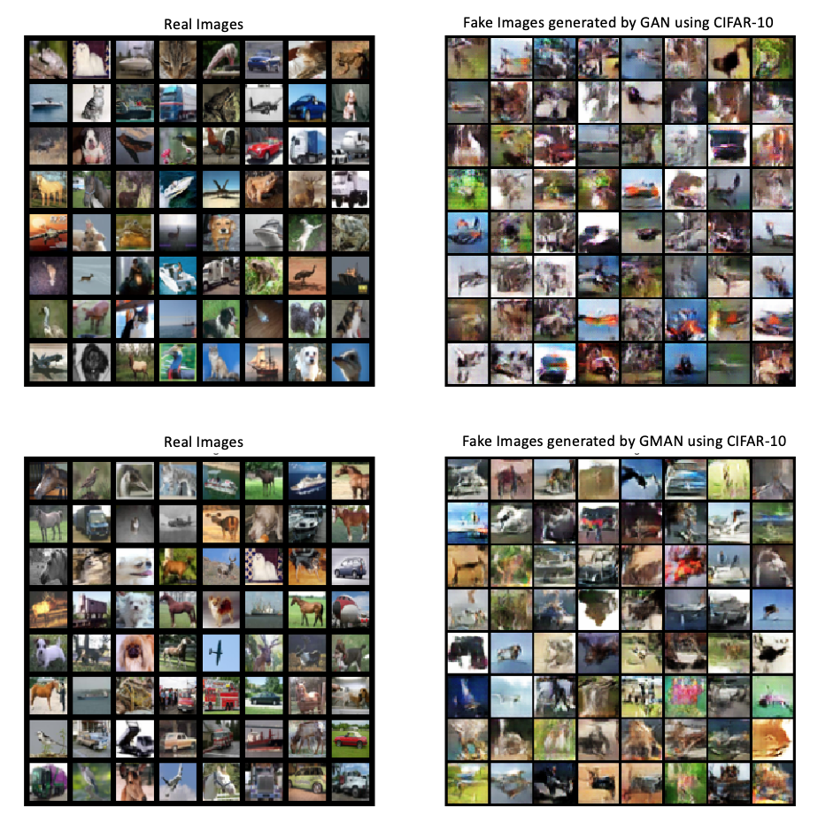

# Extensions to Generative Adversarial Neural Networks for Image Generation

## Desciption
This is a final project developed by Jim Jiayi Xu, Zhao Binglin, Xiufeng Zhao, Xiaoyin Yang, Liang Hou for UCSD Fall 2018 ee285 course.  
Contact us if you have any problem:{jjx002, bzhao, x6zhao, x4yang, l7hou}@eng.ucsd.edu

## Prerequisites
We use pytorch and colab/jupyternotebook as ...
Training on GPU GTX 1080Ti
Below is What you need to install:
```
import os
import torch
import torch.nn as nn
import torch.nn.functional as F
import torch.optim as optim
import torchvision
import torchvision.transforms as transforms
import torchvision.datasets as dset
import torchvision.utils as vutils
import numpy as np
import matplotlib.pyplot as plt
import matplotlib.animation as animation
```
## Net architectures
For DC1 network, all the layers in the discriminator are deep convolutional layers, and we use transpose convolution for  
generator.   
For DC2 network, the last convolutional layer is replaced by a fully connected layer.   


## Training process
Basicly, we use GAN, DCGAN and GMAN as training models and MNIST, CIFAR-10 datasets. (All parameters and architectures are included in our final report, please check [final report](./final_report)

### training models and their repository:  
For CIFAR-10 dataset:   
GAN with GMAN: [DC1_CIFAR.ipynb](https://github.com/houliang428/ECE285_Project/blob/master/Training/DC1_CIFAR.ipynb)  [DC1_CIFAR.ipynb](https://github.com/houliang428/ECE285_Project/blob/master/Training/DC1_CIFAR_GMAN.ipynb)    
DCGAN with GMAN:[DC2_CIFAR.ipynb](https://github.com/houliang428/ECE285_Project/blob/master/Training/DC2_CIFAR.ipynb)

For MNIST dataset:  
GAN with GMAN: [DC1_MNIST.ipynb](https://github.com/houliang428/ECE285_Project/blob/master/Training/DC1_MNIST.ipynb)  [DC1_GMAN_MINST.ipynb](https://github.com/houliang428/ECE285_Project/blob/master/Training/DC1_GMAN_MINST.ipynb)  
DCGAN with GMAN:[DC2_MNIST.ipynb](https://github.com/houliang428/ECE285_Project/blob/master/Training/DC2_MNIST.ipynb)
 
### Trained models' parameters
We use torch.save and torch.load to save the already trained models' parameters for furture evaluation.
```
torch.save(netG.state_dict(), 'netX.pt')
netX.load_state_dict(torch.load('netX.pt'))
```

## Evaluation method 
We use **GAM(Generative adverarial metric)** i.e.battle between GANs to evaluate GAN between their GMAN.  
This metric requires two GAN models M1 and M2, each comprised of their constituent G and D networks.    

M1={(G1,D1)} and M2={(G2,D2)} 

The two stages of using the GAM are the training phase and the testing phase. During the training phase, you train each model by playing the GAN minimax game with its constituent networks. During the testing phase, you compare the performances of each GAN by swapping their D networks. In this testing phase, G1 attempts to trick D2 and G2 attempts to trick D1.  (You can see all the equations in our [report](./final_report).)

## Results      
   

   

   
  
     
